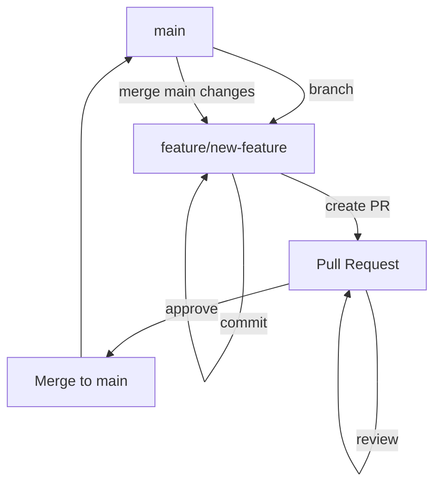
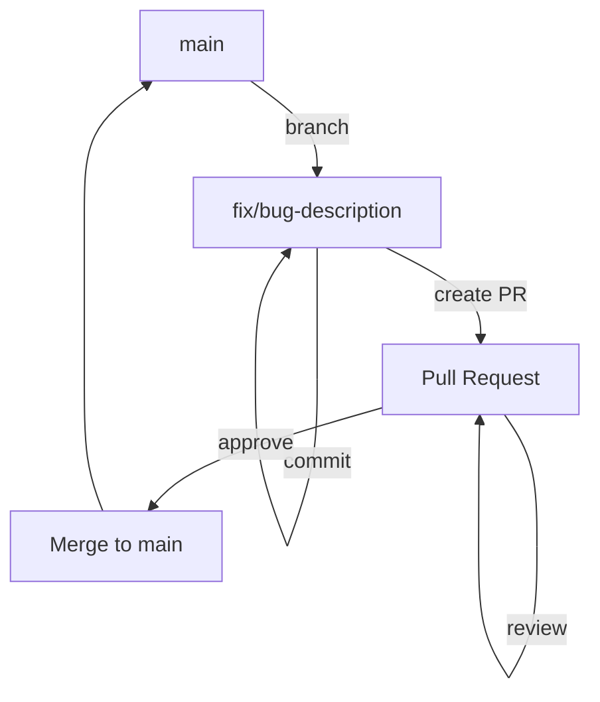
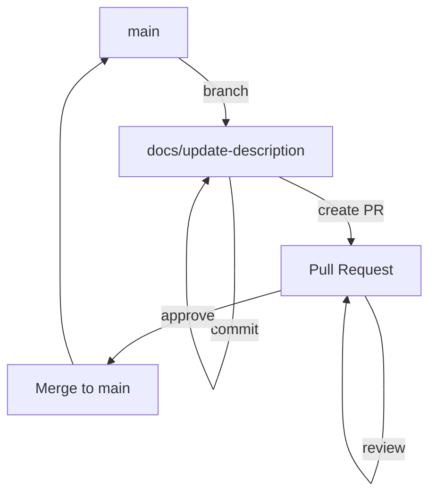

# ブランチ戦略

作成日: 2025-04-14

## 概要

このドキュメントでは、さくらセキュリティガードプロジェクトのGitブランチ戦略について説明します。適切なブランチ戦略を採用することで、開発プロセスの効率化、コードの品質維持、チームメンバー間の協力促進を図ります。

## ブランチ命名規則

### 1. メインブランチ

- `main` - 本番環境にデプロイ可能な安定版コード

### 2. 開発ブランチ

- `feature/機能名` - 新機能の開発
- `fix/問題の簡潔な説明` - バグ修正
- `docs/内容の簡潔な説明` - ドキュメントの追加・更新
- `refactor/対象の簡潔な説明` - コードリファクタリング
- `test/テスト対象` - テストの追加・更新
- `chore/タスク内容` - その他の雑務（依存関係の更新など）

### 命名例

```
feature/security-event-detection
fix/login-error-handling
docs/api-documentation
refactor/backend-structure
test/event-detection-rules
chore/update-dependencies
```

## ブランチの作成と管理

### 1. ブランチの作成

新しい作業を始める前に、最新の`main`ブランチから新しいブランチを作成します：

```bash
# mainブランチの最新化
git checkout main
git pull origin main

# 新しいブランチの作成
git checkout -b feature/new-feature-name
```

### 2. 作業の進め方

- 小さな単位でコミットを行い、各コミットは明確な目的を持つようにします。
- コミットメッセージは具体的かつ明確に記述します。
- 定期的に`main`ブランチの変更を取り込み、コンフリクトを早期に解決します：

```bash
# mainブランチの変更を取り込む
git checkout feature/new-feature-name
git fetch origin
git merge origin/main
```

### 3. プルリクエスト（PR）

作業が完了したら、プルリクエストを作成して`main`ブランチへのマージを依頼します：

1. GitHubでプルリクエストを作成
2. PRのタイトルと説明は変更内容を明確に記述
3. 関連するIssue番号を記載（例: `Fixes #123`）
4. レビュアーを指定
5. 必要に応じてラベルを追加

### 4. レビューとマージ

- すべてのPRは少なくとも1人のレビュアーによるレビューが必要
- すべてのテストが通過していることを確認
- レビューで指摘された問題を修正
- 承認されたらマージ（基本的にはスカッシュマージを推奨）

### 5. ブランチのクリーンアップ

マージ後は、不要になったブランチを削除します：

```bash
# リモートブランチの削除
git push origin --delete feature/new-feature-name

# ローカルブランチの削除
git branch -d feature/new-feature-name
```

## ブランチ保護ルール

`main`ブランチは以下の保護ルールを設定します：

1. 直接プッシュの禁止
2. PRによるマージのみ許可
3. 少なくとも1人の承認が必要
4. すべてのステータスチェック（テスト、リント）の通過が必要
5. マージ後のブランチ削除を推奨

## ブランチ戦略のワークフロー

### 1. 機能開発ワークフロー



### 2. バグ修正ワークフロー



### 3. ドキュメント更新ワークフロー



## コミットメッセージの規約

コミットメッセージは以下の形式に従います：

```
タイプ(スコープ): 簡潔な説明

詳細な説明（必要な場合）

関連するIssue（例: Fixes #123）
```

### タイプ

- `feat`: 新機能
- `fix`: バグ修正
- `docs`: ドキュメントのみの変更
- `style`: コードの意味に影響しない変更（フォーマット等）
- `refactor`: バグ修正や機能追加ではないコード変更
- `test`: テストの追加・修正
- `chore`: ビルドプロセスやツールの変更

### 例

```
feat(detection): ブルートフォース攻撃検出ルールを追加

- 10分間に5回以上の認証失敗を検出するルールを実装
- 検出時のアラート生成機能を追加
- テストケースを追加

Fixes #45
```

## ブランチ戦略の適用例

### 例1: 新機能の開発

1. Issueの作成: 「ブルートフォース攻撃検出機能の実装」
2. ブランチの作成: `feature/brute-force-detection`
3. 機能の実装とテスト
4. PRの作成: 「ブルートフォース攻撃検出機能の実装 (Fixes #45)」
5. コードレビュー
6. `main`ブランチへのマージ
7. ブランチの削除

### 例2: バグ修正

1. Issueの作成: 「ログイン画面でのエラーメッセージが表示されない」
2. ブランチの作成: `fix/login-error-message`
3. バグの修正とテスト
4. PRの作成: 「ログイン画面のエラーメッセージ表示を修正 (Fixes #67)」
5. コードレビュー
6. `main`ブランチへのマージ
7. ブランチの削除

### 例3: ドキュメント更新

1. ブランチの作成: `docs/api-documentation-update`
2. ドキュメントの更新
3. PRの作成: 「APIドキュメントの更新」
4. レビュー
5. `main`ブランチへのマージ
6. ブランチの削除

## ブランチ戦略の遵守

すべての開発者は、このブランチ戦略に従うことが期待されます。これにより、以下のメリットが得られます：

1. コードの品質維持
2. 開発プロセスの透明性
3. チームメンバー間の協力促進
4. 問題の早期発見と解決
5. スムーズなリリースプロセス

## 結論

この文書で定義されたブランチ戦略は、さくらセキュリティガードプロジェクトの開発プロセスを効率化し、コードの品質を維持するための基盤となります。すべての開発者はこの戦略に従い、必要に応じて改善提案を行うことが推奨されます。
