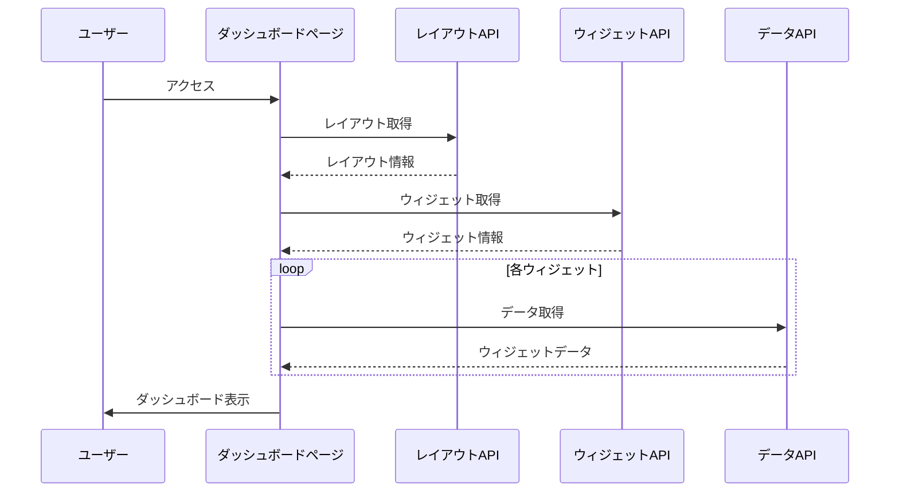

# ダッシュボード機能

作成日: 2025-04-15
作成者: 開発チーム

## 概要

さくらGuardDutyのダッシュボード機能は、セキュリティ状況の概要を視覚的に把握するための機能です。時系列データ、重要度分布、地理的分布などの情報をウィジェットとして表示し、ユーザーがセキュリティ状況を一目で確認できるようにします。

## アーキテクチャ

ダッシュボード機能は以下のコンポーネントで構成されています：

1. **フロントエンド**
   - ダッシュボードページ (`src/pages/dashboard.tsx`)
   - ウィジェットコンポーネント
   - チャートコンポーネント (react-chartjs-2を使用)

2. **バックエンド API**
   - レイアウト取得 API (`/api/dashboard/layouts`)
   - ウィジェット取得 API (`/api/dashboard/widgets`)
   - 時系列データ API (`/api/dashboard/time-series`)
   - 地理的分布データ API (`/api/dashboard/geo-distribution`)

3. **データモデル**
   - ダッシュボード関連の型定義 (`src/types/DashboardTypes.ts`)

## データフロー

1. ユーザーがダッシュボードページにアクセスする
2. フロントエンドがレイアウト情報とウィジェット情報をAPIから取得
3. 各ウィジェットが必要なデータをAPIから取得
4. データに基づいてチャートやテーブルを描画



## ウィジェットタイプ

ダッシュボードでは以下のタイプのウィジェットをサポートしています：

1. **チャート**
   - 折れ線グラフ: 時系列データの表示
   - 棒グラフ: カテゴリ別データの比較
   - 円グラフ: 割合の表示

2. **マップ**
   - 世界地図: 地理的分布の表示

3. **テーブル**
   - 最近のイベント: 最新のセキュリティイベントの表示

4. **メトリクス**
   - 重要な指標の数値表示

## カスタマイズ機能

ダッシュボードは以下のカスタマイズ機能を提供しています：

1. **時間範囲の選択**
   - 24時間
   - 7日間
   - 30日間
   - カスタム期間

2. **レイアウトの選択**
   - デフォルトレイアウト
   - コンパクトレイアウト
   - カスタムレイアウト（将来的に実装予定）

3. **自動更新**
   - 定期的なデータ更新（デフォルト: 5分ごと）

## データモデル

### 時系列データ

```typescript
export interface TimeSeriesData {
    id: string;
    title: string;
    description?: string;
    time_range: TimeRange;
    interval: '1m' | '5m' | '15m' | '30m' | '1h' | '6h' | '12h' | '1d' | '1w';
    series: {
        name: string;
        data: {
            timestamp: string; // ISO 8601形式
            value: number;
        }[];
        metadata?: Record<string, any>;
    }[];
    annotations?: {
        timestamp: string; // ISO 8601形式
        title: string;
        description?: string;
        type?: 'info' | 'warning' | 'error';
    }[];
}
```

### 地理的分布データ

```typescript
export interface GeoDistribution {
    id: string;
    title: string;
    description?: string;
    time_range: TimeRange;
    regions: {
        country_code: string;
        country_name: string;
        count: number;
        percentage: number;
        details?: {
            region: string;
            count: number;
        }[];
    }[];
}
```

### ダッシュボードレイアウト

```typescript
export interface DashboardLayout {
    id: string;
    name: string;
    description?: string;
    widgets: {
        widget_id: string;
        position: {
            x: number;
            y: number;
        };
        size: {
            width: number;
            height: number;
        };
    }[];
    created_at: string;
    updated_at: string;
    created_by: string;
    updated_by?: string;
    is_default?: boolean;
    tags?: string[];
}
```

### ダッシュボードウィジェット

```typescript
export interface DashboardWidget {
    id: string;
    title: string;
    description?: string;
    type: WidgetType;
    chart_type?: ChartType;
    data_source: string;
    query: {
        time_range: TimeRange;
        filters?: {
            field: string;
            operator: '=' | '!=' | '>' | '>=' | '<' | '<=' | 'in' | 'not_in' | 'contains' | 'not_contains';
            value: any;
        }[];
        group_by?: string;
        sort_by?: string;
        limit?: number;
        interval?: string;
    };
    options?: Record<string, any>;
    refresh_interval?: number;
}
```

## API仕様

### レイアウト取得 API

**エンドポイント**: `GET /api/dashboard/layouts`

**レスポンス**:
```json
{
  "data": [
    {
      "id": "default",
      "name": "デフォルト",
      "description": "デフォルトのダッシュボードレイアウト",
      "widgets": [
        {
          "widget_id": "time-series",
          "position": { "x": 0, "y": 0 },
          "size": { "width": 12, "height": 6 }
        },
        ...
      ],
      "created_at": "2025-04-15T00:00:00Z",
      "updated_at": "2025-04-15T00:00:00Z",
      "created_by": "system",
      "is_default": true,
      "tags": ["security", "monitoring"]
    },
    ...
  ]
}
```

### ウィジェット取得 API

**エンドポイント**: `GET /api/dashboard/widgets`

**レスポンス**:
```json
{
  "data": [
    {
      "id": "time-series",
      "title": "セキュリティイベント時系列",
      "description": "時間経過に伴うセキュリティイベントの発生数",
      "type": "chart",
      "chart_type": "line",
      "data_source": "/api/dashboard/time-series",
      "query": {
        "time_range": {
          "preset": "last_7d"
        },
        "group_by": "severity",
        "interval": "1d"
      },
      "options": {
        "show_legend": true,
        "stack_series": false,
        "y_axis_label": "イベント数",
        "x_axis_label": "日付"
      },
      "refresh_interval": 300
    },
    ...
  ]
}
```

### 時系列データ API

**エンドポイント**: `GET /api/dashboard/time-series`

**クエリパラメータ**:
- `time_range`: 時間範囲（例: `7d`）

**レスポンス**:
```json
{
  "data": {
    "id": "security-events-time-series",
    "title": "セキュリティイベント時系列",
    "description": "過去7日間のセキュリティイベント発生数",
    "time_range": {
      "start": "2025-04-08T00:00:00Z",
      "end": "2025-04-15T23:59:59Z",
      "preset": "last_7d"
    },
    "interval": "1d",
    "series": [
      {
        "name": "重大",
        "data": [
          { "timestamp": "2025-04-08T00:00:00Z", "value": 2 },
          ...
        ],
        "metadata": {
          "color": "#dc2626",
          "description": "重大なセキュリティイベント"
        }
      },
      ...
    ],
    "annotations": [
      {
        "timestamp": "2025-04-11T10:30:00Z",
        "title": "システムアップデート",
        "description": "セキュリティパッチの適用",
        "type": "info"
      },
      ...
    ]
  }
}
```

### 地理的分布データ API

**エンドポイント**: `GET /api/dashboard/geo-distribution`

**クエリパラメータ**:
- `time_range`: 時間範囲（例: `7d`）

**レスポンス**:
```json
{
  "data": {
    "id": "security-events-geo",
    "title": "セキュリティイベント地理的分布",
    "description": "国別のセキュリティイベント発生数",
    "time_range": {
      "start": "2025-04-08T00:00:00Z",
      "end": "2025-04-15T23:59:59Z",
      "preset": "last_7d"
    },
    "regions": [
      {
        "country_code": "JP",
        "country_name": "日本",
        "count": 120,
        "percentage": 40.0,
        "details": [
          { "region": "東京", "count": 75 },
          ...
        ]
      },
      ...
    ]
  }
}
```

## 今後の拡張計画

1. **カスタムダッシュボード**
   - ユーザーがカスタムダッシュボードを作成・保存できる機能
   - ウィジェットの追加・削除・移動・リサイズ機能

2. **高度なフィルタリング**
   - 複数条件によるフィルタリング
   - 保存可能なフィルタープリセット

3. **アラート統合**
   - アラートルールの作成・管理機能
   - アラート通知の設定

4. **レポート生成**
   - ダッシュボードからPDFレポートを生成する機能
   - 定期的なレポート送信のスケジュール設定

## 技術的考慮事項

1. **パフォーマンス**
   - 大量のデータを効率的に処理するためのデータ集計
   - クライアントサイドでのデータキャッシング

2. **レスポンシブデザイン**
   - さまざまな画面サイズに対応するレイアウト
   - モバイルデバイスでの表示最適化

3. **アクセシビリティ**
   - スクリーンリーダー対応
   - キーボードナビゲーション

4. **国際化**
   - 多言語対応
   - タイムゾーン対応

## 結論

ダッシュボード機能は、さくらGuardDutyの中核機能の一つであり、ユーザーがセキュリティ状況を効率的に把握するための重要なツールです。現在の実装では基本的な機能を提供していますが、今後のフェーズでさらに機能を拡張し、より柔軟で強力なダッシュボードを提供する予定です。
